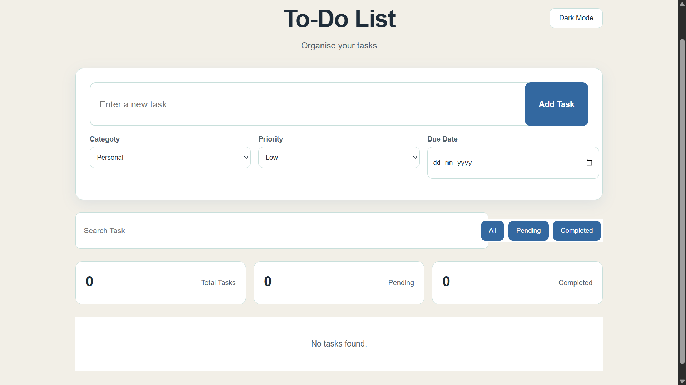
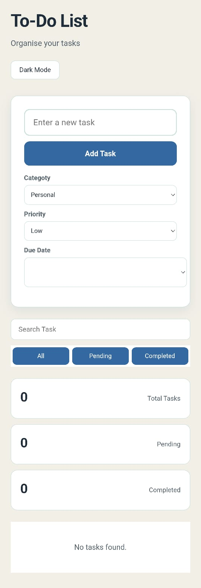

# To-Do List Application

A responsive task management web application built with HTML, CSS, and JavaScript. It helps users organize daily tasks, track their progress, and keep their tasks saved locally in the browser.

## Preview

### Desktop



### Mobile



## Features

- Add new tasks with validation
- Edit existing tasks
- Delete unwanted tasks
- Mark tasks as completed or pending
- Task categories
- Task priority levels
- Due dates
- Search tasks by title
- Filter tasks by:
  - All
  - Pending
  - Completed
- Display total, pending, and completed task counts
- Save tasks using Local Storage so they remain after refreshing the page
- Dark mode support
- Responsive design for desktop and mobile screens
- Empty-state message when no matching tasks are available

## Technologies Used

- HTML5
- CSS3
- JavaScript
- Local Storage API

## How It Works

Tasks are stored as JavaScript objects inside an array. Whenever a task is added, edited, completed, or deleted, the updated task list is saved to Local Storage.

The application then re-renders the task list so the interface stays synchronized with the stored data.

## Task Information

Each task can contain:

- Task title
- Category
- Priority
- Due date
- Completion status

## Responsive Design

The interface adapts to different screen sizes, including desktop and mobile layouts. The task form, search controls, filters, statistics, and task cards adjust for smaller screens.

## Project Structure

```text
To-Do-List/
│
├── index.html
├── style.css
├── todo.js
├── todoUI-pc.png
├── mobileUI.jpeg
└── README.md
```

## Getting Started

1. Clone the repository.
2. Open the project folder.
3. Open `index.html` in a browser, or run it using a local development server such as VS Code Live Server.
4. Start adding and managing your tasks.

## Future Improvements

- Task sorting by due date or priority
- More advanced task editing
- Task reminders
- Additional categories
- Improved accessibility

## Internship Project

This To-Do List application was developed as part of my **CodSoft Internship** using HTML, CSS, and JavaScript.

## License

This project was created for educational and internship purposes as part of the CodSoft Internship.

## Author

Swati Manjari Panda
